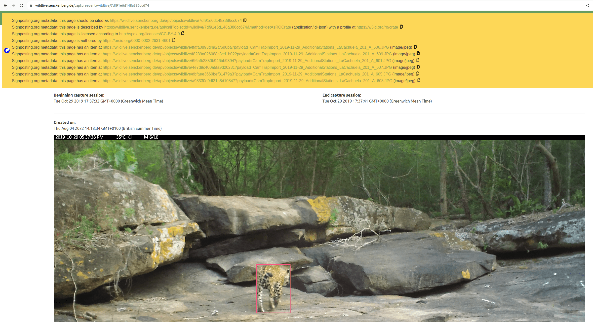
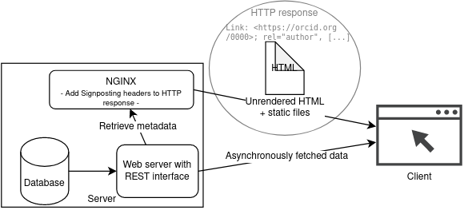
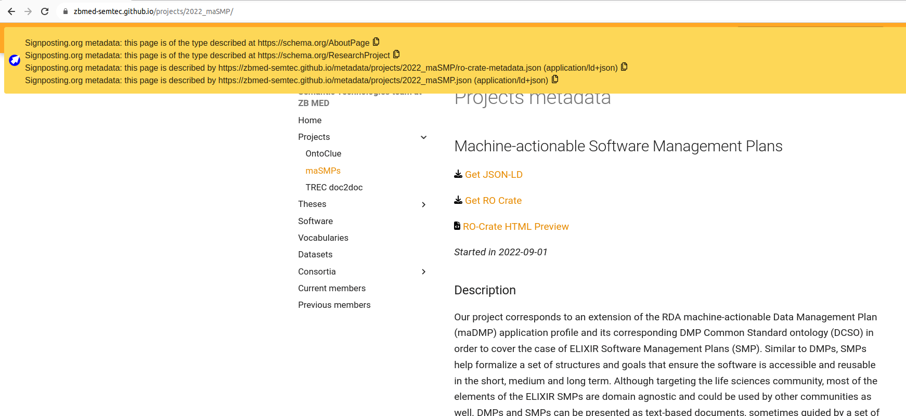

As part of the BioHackathon Europe 2023, we here report from the progress of the hackathon project #15: "Enabling FAIR Digital Objects with RO-Crate, Signposting and Bioschemas". We added Signposting to three existing resources, and made a Chrome browser extension to show Signposting headers. We added RO-Crate to two existing resources, and explored making a hybrid FDO using both a Handle PID Record and Signposting/RO-Crate approach.


# Introduction

[RO-Crate](https://www.researchobject.org/ro-crate/) [@citesAsAuthority:10.3233/ds-210053] is a lightweight method to package research outputs along with their metadata. [Bioschemas](https://bioschemas.org/) [@citesAsAuthority:Bioschemas] provides metadata schemas to add structured metadata to webpages on Life Science. [Signposting](https://signposting.org/FAIR/) [@citesAsAuthority:vandesompelFAIRSignpostingProfile2022] [@extends:vandesompel2015]  provides a lightweight yet powerful approach to increase the FAIRness of scholarly objects. [FAIR Digital Object](https://fairdo.org/specifications/) (FDO) [@citesAsAuthority:fdo-Overview] is a set of conceptual specifications for building an interoperable ecosystem of machine-actionable resources, with a strong emphasis on persistent identifiers, types and metadata.

The combination of RO-Crates, Bioschemas and Signposting make resources easy to navigate by machines, provide an unambiguous way for machines to access FAIR metadata and content in a single request, and reduce content-negotiation hassle that can give unpredictable results [@citesAsAuthority:soiland_FDO_2022].

This tripartite combination is of benefit for repositories and publishers as they can non-disruptively add FAIR Signposting headers for machine navigation, support RO-Crate imports and align with Bioschemas specifications, making FAIR Digital Objects achievable with existing technologies over HTTP [@citesAsAuthority:10.3897/rio.8.e94501].

FAIR tooling implementers can also benefit, as they could create, improve or integrate Signposting clients combined with RO-Crate libraries implementing Bioschemas specifications. On its side, FAIR data implementers could support consumption of FAIR Signposting and create Knowledge Graphs from RO-Crates.

While Bioschemas has been adopted by many repositories, the methods for its consumption have largely been focused on discoverability. Now we focus on integrations, such as building scholarly knowledge graphs from multiple Bioschemas sources.

Finally, FAIR outreach practitioners showcase uses of FAIR Signposting to navigate and consume RO-Crates making FAIR closer to the community. This project will continue the effort started as part of FDO2022 [@discusses:looFirstInternationalConference2022] and FAIR-IMPACT to enable FAIR Signposting and RO-Crate for content/metadata discovery and consumption.


# Initial plan

Our initial plan was to work in several parallell streams:

* Add metadata markup/headers to landing pages of at least one website. This was also intended as a drop-in anyone at the Hackathon to add FAIR Signposting. Bioschemas metadata or RO-Crate for existing persistent identifiers and metadata resources.
* Improve at least one Signposting client, e.g. [Signposting for Python](https://signposting.readthedocs.io/), [for Ruby](https://github.com/markwilkinson/linkheader-processor) or a new client for JavaScript or Java.
* Improve Bioschemas/RO-Crate validation for at least one profile
* Prototype FAIR Digital Object (FDO) implementation using Signposting, PIDs and RO-Crate
* Conceptualise and draft FDO "configuration type" profile for Signposting-based FDO implementation
* Other ideas included prototyping a knowledge graph from pages using any of the technologies, or to build a validator for FAIR Signposting.


# Results

Given the participants joining this hackathon project, we focused on three topics:

1. Adding and visualising Signposting to existing resources: two repositories ([HoloFood Data Portal](www.holofooddata.org), [Wildlive data portal](https://wildlive.senckenberg.de/)) using HTTP signposting, and a GitHub Pages-based web site ([ZBMed SemTec](https://zbmed-semtec.github.io/)) using HTML signposting. 
2. Adding RO-Crate to existing resources (Wildlive data portal and ZBMed SemTec website)
3. Explore making an Handle/Web hybrid FDO with persistent identifers (Wildlive data portal).

## Visualising Signposting

[Signposting](https://signposting.org/) is explicitly designed to add machine-readable links to the metadata associated with a human-readable scholarly object.
Taking the canonical example of a web landing page for a dataset, which humans parse as rendered HTML, Signposting adds invisible links to remote resources like an ORCID profile of the author, a DOI the resource can be cited as, and downloadable items of the dataset like images and data tables.
These are implemented as HTTP headers (`Link: <https://orcid.org/0000…">; rel="author"`) or HTML header link tags (`<link href="https://doi.org/10.5281/zenodo…" rel="item" type="application/zip"/>`).

Typically, these implementations do not render anything that a user of the landing page will see (without using developer tools to inspect the source of the material they're viewing).
This means that resource authors and developers need to use debugging tools to develop and test their implementations of Signposting: for example browser developer tools, or bespoke parsers for the Signposting headers [@citesAsPotentialSolution:Signposting_link_parser].
It also means that users discovering data resources with a view to then accessing them programatically, for example in a new pipeline or data ingestion process, will need to find the links to programmatic access options by browsing the web pages and documentation, rather than following the same shortcuts that robot agents can see.

During BioHackathon Europe 2023 we developed a browser extension [signposting-chrome-extension](https://github.com/SandyRogers/signposting-chrome-extension), initially targetting Chromium-based browsers, to render Signposting links as a visible bar on landing pages.
This helps resource developers to quickly verify their Signposting implementations and notifies resource users to the possible citation, contact, and programmatic access options they might use.

As an experiment we modified the [HoloFood Data Portal](www.holofooddata.org) to include Signposting HTTP headers to its own API exposure of JSON metadata. As these are following the [site-specific OpenAPI](https://www.holofooddata.org/api/openapi.json) we used this as the `profile` identifier. This is an example of how Signposting can help machine-clients navigate from human-readable web-pages to machine-readable APIs even if no further FAIRifications have not yet been applied (e.g. persistent identifiers, metadata following common vocabularies), in effect making a "level 0" FDO.


## Indexing RO Crates in backend databases
In their JSON-LD schema form, RO-Crates are a document rendered to describe the metadata (and possibly some summary data, like a measured [`PropertyValue`](https://schema.org/PropertyValue)).
In their compressed form (e.g. a `.zip` file), they can also contain one or more files – typically HTML renderings of the schema, other HTML reports like those generated by computational workflow runs, and data files like `.tsv` tables or image files.
In both cases, these crates are usually **derived** products: either rendered on demand when a client visits a URL (e.g. `http://my.data/dataset/1?format=ro_crate`), or created in advance and stored on an object store potentially with a new identifier/URI unrelated to the dataset's natural identifier.

However RO-Crates have the potential to be used more holistically than this, with the schema profile acting as a glue between the self-describing crates and the business logic or database schema of a data repository.

Given a profile that describes some mandatory parameters:


| Property | Required? | Description                                |
| -------- | --------- | ------------------------------------------ |
| name     | MUST      | String representation of the dataset name  |
| pipeline | MUST      | URI of the `ComputationalWorkflow` used    |
| ...      | ...       | ...                                        |

RO-Crates conforming to this profile will include `name` and `pipeline` fields in the root data context (i.e. JSON paths like `crate.@graph[?].name` and `crate.@graph[?].pipeline.@id`).

If a data repository needed to index this dataset, for listing, searching and cross-referencing purposes, a database might be constructed with a schema:

| id† | dataset_name†   | pipeline_uri†  | data_uri                 | crate_uri                                |
| --- | --------------- | -------------- | ------------------------ | ---------------------------------------- |
| 1   | My Dataset      | http://my.code | http://my.data/dataset/1 | http://my.data/dataset/1?format=ro_crate |

where † = columns indexed by the database engine, to allow lookups with scanning the entire table.
In most relational database engines, this kind of indexing is required for realtime lookups of "all the datasets created by a certain pipeline".

During BioHackathon Europe 2023, we explored the possibility of using relational database's JSON fields (which are now a stable feature of engines such as [PostgreSQL](https://www.postgresql.org/docs/current/functions-json.html)) to create an equivalent database schema working directly on the RO-Crate JSON-LD.

In a production setting, data repositories often use an Object Relational Mapper (ORM) to manage their database rather than executing queries directly.
Therefore we developed a Prototype using [Django](https://code.djangoproject.com), a popular Python-based ORM, with a Postgres backend.

The table schema was:

| id   | crate_schema                  | crate_name    |
| ---- | ----------------------------- | ------------- |
| int  | jsonb                         | varchar       |
| ---- | ----------------------------- | ------------- |
| 1    | `{"@graph": [{"@id": "./"...` | My Dataset    |

We used this schema to explore two approaches to querying this table of crates.
Firstly, we used a feature of the fortchoming [Django 5.0 release](https://docs.djangoproject.com/en/dev/releases/5.0/#database-generated-model-field): `GeneratedField`s.
Generated Fields allow the ORM model to have a schema like:

```python
class Crate(Model):
    crate_schema = models.JSONField(default=dict, null=True, blank=True)
    crate_name = models.GeneratedField(
        expression=F('crate_schema__@graph__0__name'),
        db_persist=True,
        output_field=models.CharField(max_length=100)
    )
```

This approach ensures that any create or update operations on a Crate instance in the database, for example when a new crate conforming to the supported profile is deposited, result it some of the crate's properties being correctly indexed.
Likewise if the database schema needs to change, for example to add the `pipeline_uri` column a schema migration will automatically populate the new column with the correct metadata from each crate instance.

Secondly, we used a Generalized Inverted Index (GIN index) to create a database index over the crate schema.
GIN indices are useful for cases where queries across a composite data type are needed; for our crate database this might be to query for crates where an additional profile is conformed to, or where the crate references a certain `FundingAgency`.
This was only partially successful: whilst we could trivially create a GIN index on the entire JSON-LD `crate_schema`, a more realistic implementation would be to selectively (and therefore performantly) index only part of the crate graph using a query to create the index. We did not achieve this step.


## Implementing Signposting on a Single Page Application

Senckenberg has brought their [Wildlive data portal](https://wildlive.senckenberg.de/), a work-in-progress repository and analysis platform for biodiversity monitoring, as a use case into this Biohackathon project. Wildlive provides data models to describe i.a. observational data from camera traps, our aim was to enable the representation of those data employing both RO-Crates and Signposting to increase interoperability and machine actionability of data provided by the platform. RO-Crates were implemented in the form of an additional API endpoint which serializes the metadata from the data portal's internal metadata schema to a `ro-crate-metadata.json`. This [detached RO-Crate](https://www.researchobject.org/ro-crate/1.2-DRAFT/structure.html#detached-ro-crate) describes a "package" of camera trap observations which were all recorded caused by the trigger event that triggered the camera sensor, where each observation contains an image 
(possibly with one or many species occurrences). 

The implementation of this RO-Crate layer on top of the existing data portal was rather straightforward. In contrast, the implementation of Signposting required more work and shall be explained in more detail here.

The difficulty in adding Signposting to the Wildlive data portal was in that the portal was built as a [Single Page Application](https://en.wikipedia.org/wiki/Single-page_application)(SPA), based on [VueJS](https://vuejs.org/). This means that upon a request from a client (usually a web browser), the server returns a generic, static HTML file and JavaScript code. Afterwards, the code is executed in the browser and the content-specific data is loaded asynchronously via API calls to the backend of the application. To implement Signposting, links to related web resources of a website can either be added to the HTML header or to the header of the HTTP response of the server. However, to add these links, content-specific metadata is required which is not yet available when the server initially answers the client's request.

This problem is comparable to the problem that many SPA-based websites have which seek to add specific metadata markup to their websites HTML to achieve search engine optimization. Typical solutions to this problem are the implementation of a server-side rendering or pre-rendering step based on an additional NodeJS-based webserver in the backend of the application. During this step, some parts or all of the HTML are being rendered on the side of the server (which allows to add metadata markup e.g. for search engine crawlers but also for Signposting), before the SPA is delivered to the client.



However, typical solutions like adding server-side rendering were not feasible to add to the existing Wildlive data portal because they require a lot of changes on the application's code structure itself. Instead, we came up with a lightweight method to add Signposting to the landing pages of the camera trap observations. For this, we made use of the fact that Signposting links must not necessarily be included in the HTML header, but are also allowed to be only transported via the HTTP `Link` header (unlike for search engine optimization where the content-specific markup must be in the HTML that a client receives). 

The Wildlive data portal, like many other SPA-based websites, is based on a lightweight webserver, in this case [NGINX](https://nginx.org/), which serves the static files of the website. NGINX with the addional `nginx-module-njs` allows to add custom scripting based on JavaScript code to the webserver configuration. Therefore, we added a custom script which upon a request to the frontend landing page of a certain observation dataset, makes an internal request to the API to retrieve the content-specific metadata. Based on this metadata, the correct Signposting links are generated and added to the HTTP response which returns the static HTML to the client (see Fig. 2).

With this, we managed to add Signposting HTTP headers to an existing SPA-based data portal, without having to change any application code of the data portal. A drawback is that in this setup the API receives two requests, one to build the Signposting headers before responding the client's request, and one later when the application is loaded asynchronously in the client browser (in the case that the request has not been made by a machine-agent without a browser).




## Hybrid FDO using Handles and Signposting

As an experiment of a hybrid deployment of FDOs with a Signposting/RO-Crate overlay, we augmented the Wildlive as it is built on Cordra, which has FDO support using DOIP [@citesAsPotentialSolution:tupelo-schneckrobertBriefIntroductionCordra2022]. We experimented with minting persistent identifiers as Handles that also included the FDO kernel metadata [@citesAsPotentialSolution:fdo-KernelAttributes] in the PID record -- that is in the Handle key/value pairs. 

The handle <https://hdl.handle.net/21.T11998/wildlive.7df91e6d148a386cc674> was minted manually using the EOSC B2Handle test service. Senckenberg plans to deploy their own Handle server to mint persistent identifiers automatically for every digital object using their own Handle prefix and Cordra's Handle support.  From the FDO principle that metadata FDOs can be separate from the main FDO, a separate handle <https://hdl.handle.net/21.T11998/wildlive.crate.7df91e6d148a386cc674> was registered for the corresponding RO-Crate. 


Another reason for having a separate PID for the RO-Crate is that it is on higher level than the fairly granular digital objects underlying it, for instance in the traditional Digital Object JSON APIs for <https://wildlive.senckenberg.de/api/objects/wildlive/7df91e6d148a386cc674> we have implied references to `wildlive/38a8bb080a5e48fdd309` (aka <https://wildlive.senckenberg.de/api/objects/wildlive/38a8bb080a5e48fdd309>) as nested objects for each observation, which then again has an image object <https://wildlive.senckenberg.de/api/objects/wildlive/ffafa0893d4a2af6d0ba>. However in the corresponding RO-Crate, all of these objects are described together, avoiding multiple API calls.  


.

It is notable that in Senckenberg's particular case, the JSON of the FDO objects in the API are already also valid JSON-LD, but using a mixture of vocabularies mapped from a [JSON context](https://wildlive.senckenberg.de/api/objects/wildlive/basecontext.jsonld), including [Darwin Core](https://dwc.tdwg.org/) and [Semantic Sensor Network Ontology](https://www.w3.org/TR/vocab-ssn/). In this case the RO-Crate is an example of a higher-level mapping using a common vocabulary (schema.org), with an domain-specific API co-existing for when additional details are needed.

In a completed hybrid FDO implementation, each of these nested objects would again have their own handles, which would also be reflected in the common RO-Crate using `identifier` property, and with FAIR Signposting as cross-reference navigating between the web page (which shows navigation of the observation images), the RO-Crate, and each of the API objects. 

In this experiment we identified some issues with the Handle/FDO approach: 

1. Unclear which Handle property to use to indicate fdo profile. `fdoProfile` was chosen, in correspondance with the DISSCo kernel attributes [@citesAsAuthority:dissco-kernel], and stored at handle index `1`. The profile is pointing to <https://w3id.org/ro/crate> which is registered in the [IANA profile registry](https://www.iana.org/assignments/profile-uris/) and corresponds to the `profile=` signposting parameter.  Ideally the key for this should itstead be a full PID or defined by the FDO specification, for comparison the [BioDT Kernel attributes](https://github.com/BioDT/biodt-fair/discussions/3) are defining the key `profile` but also in index `1`.
2. Requesting the B2Handle service from the [EOSC marketplace](https://marketplace.eosc-portal.eu/services/eosc.eudat.b2handle) ws very slow, taking several weeks before the hackathon, only to be given access to a buggy test prefix server with various SSL deployment problems and inability to update a handle after registration. The B2Handle helpdesk was however very helpful.
3. Unclear if index in the Handle record matters -- both DiSSCO and BioDT use the indexes as a way to organize the keys, but these can of course then be in conflict.
4. Unclear how much of the FDO metadata should be duplicated in the handle. We didn't experiment with mapping and registering the full DiSSCO or BioDT handle kernel information, but stayed at a Signposting-like level of persistent identifiers, metadata resources, and profiles of those.

Lessons learnt include:

1. User in focus. Make sure human browsers get HTML from a PID (use `10320/LOC` mechanism to register both API and HTML resolution)
2. Use full <https://hdl.handle.net/> URIs for handle references, not partial identifiers like `wildlive/38a8bb080a5e48fdd309` -- however doing this on server-side puts a stronger requirement to get easy access to production-level handle servers in advance.
3. A profile-for-profiles are needed. It is still too unclear how to express a profile. JSON Schema kind-a works but is rudimentary. RO-Crate specify (sub)profile inside itself (which may be to a [Profile Crate](https://www.researchobject.org/ro-crate/1.2-DRAFT/profiles#profile-crate)). Should sub-profiles also be listed in the PID and Signposting?  For the higher granularity FDO API, we assume the profile will point to the corresponding JSON Sehema, e.g. <https://hdl.handle.net/21.T11998/b93260a5-a6c3-4db7-9b66-a093f842a6c6> but this definition needs a profile-for-profile to indicate it is a JSON Schema.
4.  Granularity varies. The FDOs may be fine-grained (e.g. to support their operations), and an RO-Crate should make sense on its own -- augment with metadata from compound FDOs.


## Implementing RO Crates and Sigposting in GitHub pages

The [Semantic Technologies (SemTec) team](https://zbmed-semtec.github.io/) in [ZB MED](https://www.zbmed.de/en/) uses GitHub pages to share research projects and corresponding research artefacts/outcomes (e.g., datasets, software, metadata schemas/ontologies, posters, reports, preprints, scholarly publications). The pages embed Bioschemas and [schema.org](https://schema.org/) markup to facilitate findability and connectivity of the research outcomes. The goal behind implementing RO-Crates and Signposting is supporting a lightweight approach to FDOs [@citesAsPotentialSolution:Soiland_FDO_2022] [@citesAsPotentialSolution:Castro_FDO_2023]. The FDO approach [@citesAsAuthority:Smedt_FDO_2020] corresponds to a series of recommendations to increase and extend FAIRness to cover typed operations, allowing implementation via different compliant configurations [@citesAsAuthority:fdo-ConfigurationTypes]. This work was initiated as part of a FAIR-Impact Support Action and advanced to an initial implementation during the BioHackathon. As a result, the SemTec team now supports RO-crates for research projects and theses with Signposting level 2.



For instance, the page <https://zbmed-semtec.github.io/projects/2022_maSMP/> has signposting to the RO-Crate metadata file <https://zbmed-semtec.github.io/metadata/projects/2022_maSMP/ro-crate-metadata.json> (with corresponding [ro-crate-preview.html](https://zbmed-semtec.github.io/metadata/projects/2022_maSMP/ro-crate-preview.html)).  The page also has signposting to the existing Bioschemas JSON-LD markup, which don't follow the RO-Crate profile (as it do not have a top level root dataset), machines can tell the difference by inspecting the `profile` argument.

# Conclusion and Future Work

We have presented here various approaches to implement RO-Crates and Signposting, some of them also supporting Bioschemas markup. This combination aims at improving interoperability and reusability. The ZB MED SemTec team will get permanent, unique and global identifiers for the RO-Crates and the corresponding GitHub pages to improve FDO compliance, it will also add software to the research artefacts implementing RO-crate. The experiments with hybruid FDOs show how Signposting and RO-Crate can co-exist as "webby FDOs" side by side with "traditional" FDOs, with some additional requirements for the persistent identifiers.

## Acknowledgements

The work corresponding to the ZB MED SemTec team pages has been partially supported by the NFDI4DataScience project funded by the German Research Foundation (DFG) (no. 460234259), and the FAIR-Impact GA 101057344 Support Action #2: Enabling FAIR Signposting and RO-Crate for content/metadata discovery and consumption. Work corresponding to the Senckenberg team has been partially supported by Biodiversity Digital Twin for Advanced Modelling, Simulation and Prediction Capabilities ([BioDT](https://biodt.eu/)) (Horizon Europe, GA no. 101057437), and [NFDI4Earth](https://www.nfdi4earth.de/) - NFDI Consortium Earth System Sciences (DFG, no. 460036893). Work with handles has been supported by UK Research and Innovation (UKRI) under the UK government's Horizon Europe funding guarantee for 10038930 ([BioDT](https://biodt.eu/)) 10038963 ([EuroScienceGateway](https://eurosciencegateway.eu/)), 10038992 ([FAIR-IMPACT](http://fair-impact.eu/)) and by Horizon Europe GA 101046203 ([BY-COVID](https://by-covid.org/)).

We also acknowledge the many ELIXIR BioHackathon Europe 2023 participants we interacted with. This work was [presented](https://slides.com/soilandreyes/2023-11-13-bh2023-fdo) at an FDO meeting 2023-11-13 and we are grateful for the discussion there which further informed this paper.


# References
<!-- see paper.bib -->

